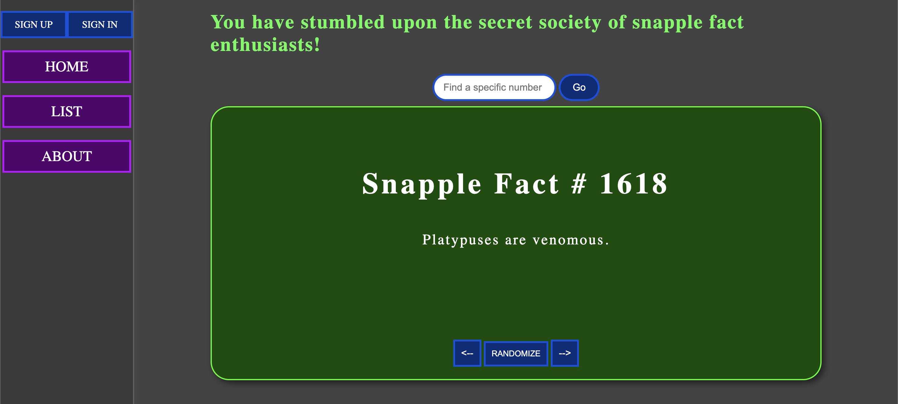
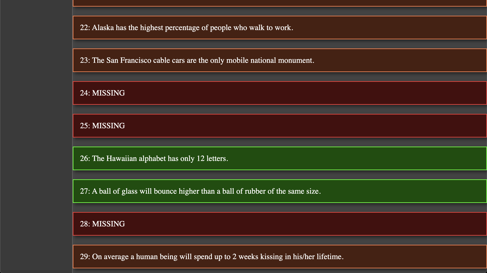

# Snapple-facts
This website is an attempt to compile and display all of the snapple facts in existence. 





#### Features:

* Home page displays a single random snapple fact, it will only display facts that are still in circulation.
* The "List" page will show all snapple facts, green ones are still in circulation, orange ones are retired but discovered, red ones are retired and undiscovered. We need your help to find them all!
* You have the ability to create an account and comment on snapple facts that are missing. If you know what it should be please submit a comment with the source. The admin will look over this information and if it is determined that the submitted fact is correct the site will be updated to include the fact and your account will be credited with finding it.
* Registered users also have the ability to "Star" specific facts that the user enjoys and wants to easily find again.

#### How To Get Started:

&nbsp;&nbsp;&nbsp;&nbsp;&nbsp;&nbsp;Visit: https://snapple-facts-9db5080654aa.herokuapp.com/

* Familiarize yourself with the site, visit the home page and view a few random facts.
* Create a profile in order to submit comments and star facts
* Visit the "List" page to view all facts and star the ones you stand out.

#### Technologies Used:

* HTML 
* CSS 
* Javascript 
* EJS 
* Express 
* MongoDB 
* mongoose 
* RESTful HTTP API

```
.
├── README.md
├── models
│   ├── comment.js
│   ├── snapple-fact.js
│   └── user.js
├── views
│   ├── about.ejs
│   ├── auth
│   │   ├── sign-in.ejs
│   │   └── sign-up.ejs
│   ├── facts
│   │   ├── edit.ejs
│   │   ├── index.ejs
│   │   └── show.ejs
│   ├── index.ejs
│   ├── partials
│   │   └── sidebar.ejs
│   └── users
│       ├── comments.ejs
│       ├── show.ejs
│       └── stars.ejs
├── controllers
│   ├── auth.js
│   ├── facts.js
│   └── users.js
├── middleware
│   ├──  is-signed-in.js
│   └──  pass-user-to-view.js
├── public
│   ├── css
│   │   └── style.css
│   └── images
├── seed
│   ├── finder.js
│   └── source.js
└── server.js
```

#### Next Steps:

* Refactor styling, to use sass
* finish implementing star system 
* create consistent color palette 